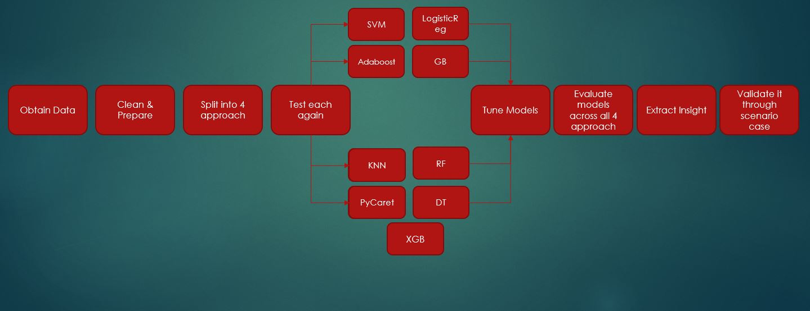

# Title of your project

# Summary

**Motivation:** As part of my data science bootcamps projects, we intent to perform "customer churn modeling" for company within the telecom industry
 
 **Goal:** The goal is to test and train multiple machine learning models in order to select the one with most valid business case
 
 **Business Case:** The company will be using this model to predict customers at risk of churning. hypothetical case was:
 1- The contract's life time value is 1000$
 2- Customers at risk of churning will be called and offered 10% discount if they maintain/continue their contract
 3- based on the model results, what is the net effect on the company's income statement
 
 **Next Steps:** 
 - Test if customer's location has any impact on customer's behaviour
 - Test if manipulating correlated features will have impact on customer's behaviour and subsequently churning rate
 - Expand more on hyperparameter tuning
 **Structure of the document:** if the document is getting big, outline the structure and explain the different parts
 
# Introduction
The approach was as following

Here is an example of including images:

# Part 1 Title
Ideally, your work should be broken down into several parts so that it's easier to have a global view of the work you have done

# Part 2 Title

# Part 3 Title

# Conclusion & Recommendations

write a paragraph on the main results of your work.

write a paragraph on what should be done (further study, or actions...)

# References

- [this is a first link](https://www.google.com/)
- [this is another link](https://www.google.com/)
- [this is a third link](https://www.google.com/)
